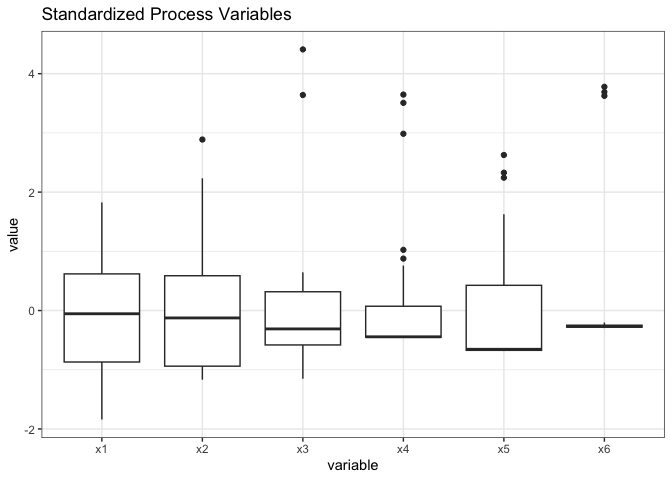
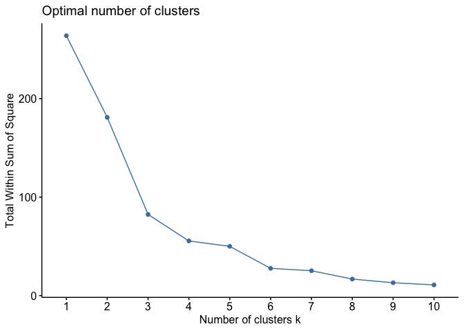
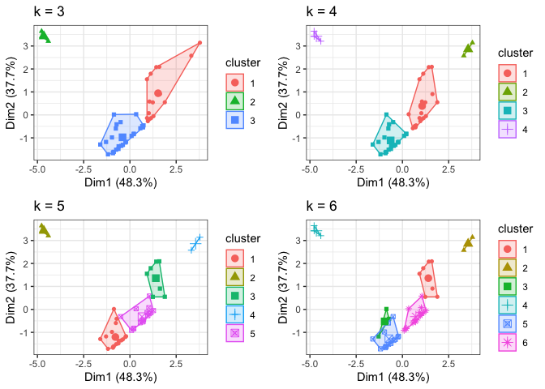
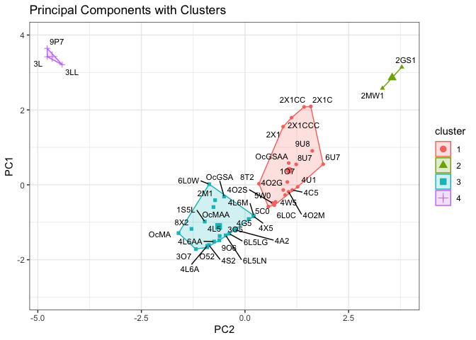
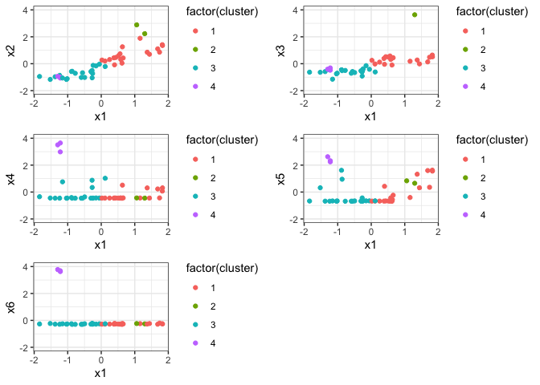
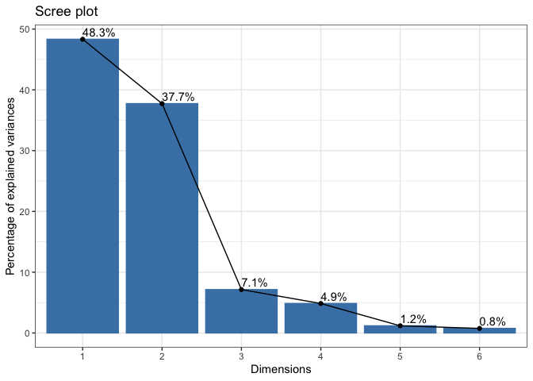
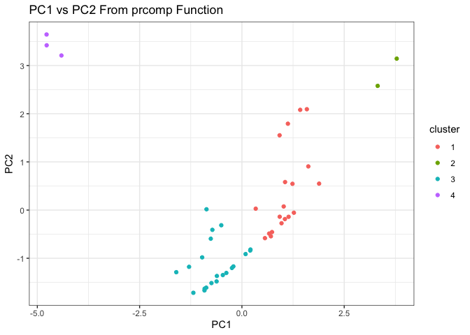
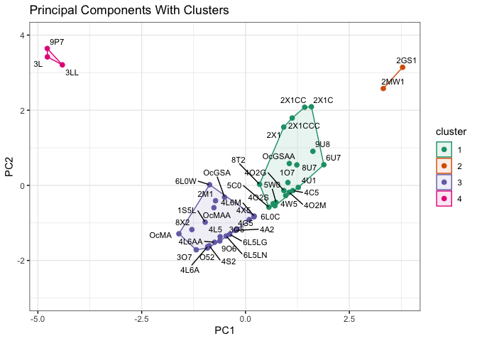

Chapter 4 - Principal Component Analysis
================
2024-02-12

``` r
# Import libraries and data set
library(tidyverse) # data cleaning and processing
library(factoextra) # clustering and PCA (fviz)
library(ggrepel) # text on charts
library(gridExtra) # display multiple charts in a grid (grid.arrange)
library(kableExtra) # pretty tables (kbl, kable_classic_2)
library(psych) # factor analysis (fa.diagram)
library(ggpubr) # outlining clusters (ggscatter)
library(RColorBrewer) # color palettes
library(wesanderson) # more color palettes

raw <- read_table("dataset3.txt")
```

``` r
### Select variables and clean the data
raw1 <- raw |>
  select(ProdName, 8, 9, 10, 26, 27, 28) |>
  rename(x1=2, x2=3, x3=4, x4=5, x5=6, x6=7) |>
  column_to_rownames(var="ProdName") 

### Scale the data set
df <- raw1 |>
  scale()
```

``` r
### Box plots of scaled data
df |>
  as_tibble() |>
  pivot_longer(cols = 1:6, names_to = "variable", values_to = "value") |>
  ggplot(aes(x = variable, y = value)) +
  geom_boxplot(color = 'blue') + theme_bw() + ggtitle("Standardized Process Variables")
```

<!-- -->

``` r
### Correlation matrix
df |> cor()
```

    ##            x1         x2         x3         x4        x5         x6
    ## x1  1.0000000  0.8698282  0.5836231 -0.2541928 0.1375875 -0.3311137
    ## x2  0.8698282  1.0000000  0.8390073 -0.2356561 0.1659253 -0.2654576
    ## x3  0.5836231  0.8390073  1.0000000 -0.1609694 0.2122357 -0.1032729
    ## x4 -0.2541928 -0.2356561 -0.1609694  1.0000000 0.6410889  0.9154117
    ## x5  0.1375875  0.1659253  0.2122357  0.6410889 1.0000000  0.6530923
    ## x6 -0.3311137 -0.2654576 -0.1032729  0.9154117 0.6530923  1.0000000

``` r
### Summary
df |> summary()
```

    ##        x1                 x2                x3                x4          
    ##  Min.   :-1.84030   Min.   :-1.1680   Min.   :-1.1516   Min.   :-0.45984  
    ##  1st Qu.:-0.86922   1st Qu.:-0.9395   1st Qu.:-0.5812   1st Qu.:-0.45073  
    ##  Median :-0.05437   Median :-0.1250   Median :-0.3102   Median :-0.44365  
    ##  Mean   : 0.00000   Mean   : 0.0000   Mean   : 0.0000   Mean   : 0.00000  
    ##  3rd Qu.: 0.61886   3rd Qu.: 0.5877   3rd Qu.: 0.3172   3rd Qu.: 0.07251  
    ##  Max.   : 1.82596   Max.   : 2.8877   Max.   : 4.4099   Max.   : 3.64714  
    ##        x5                x6         
    ##  Min.   :-0.6844   Min.   :-0.2968  
    ##  1st Qu.:-0.6722   1st Qu.:-0.2806  
    ##  Median :-0.6543   Median :-0.2676  
    ##  Mean   : 0.0000   Mean   : 0.0000  
    ##  3rd Qu.: 0.4259   3rd Qu.:-0.2481  
    ##  Max.   : 2.6269   Max.   : 3.7786

``` r
### k-means clustering
set.seed(123) # for reproducibility
fviz_nbclust(df, kmeans, method = "wss")
```

<!-- -->

``` r
### Visualizing clusters
set.seed(123) # for reproducibility
k3 <- kmeans(df, centers = 3, nstart = 25)
k4 <- kmeans(df, centers = 4, nstart = 25)
k5 <- kmeans(df, centers = 5, nstart = 25)
k6 <- kmeans(df, centers = 6, nstart = 25)

### plots to compare cluster options
p1 <- fviz_cluster(k3, geom = "point",  data = df) + ggtitle("k = 3") + theme_bw()
p2 <- fviz_cluster(k4, geom = "point",  data = df) + ggtitle("k = 4") + theme_bw()
p3 <- fviz_cluster(k5, geom = "point",  data = df) + ggtitle("k = 5") + theme_bw()
p4 <- fviz_cluster(k6, geom = "point", data = df) + ggtitle("k = 6") + theme_bw()

grid.arrange(p1, p2, p3, p4, nrow = 2)
```

<!-- -->

``` r
### selected cluster summary
k4
```

    ## K-means clustering with 4 clusters of sizes 19, 2, 21, 3
    ## 
    ## Cluster means:
    ##           x1         x2         x3         x4          x5         x6
    ## 1  0.8523430  0.6917800  0.2946918 -0.2531106  0.01051137 -0.2615976
    ## 2  1.1768928  2.5604804  4.0248301 -0.4446579  0.74558689 -0.2464719
    ## 3 -0.7050756 -0.7262429 -0.5929480 -0.2114966 -0.42328581 -0.2681980
    ## 4 -1.2472384 -1.0045599 -0.3989655  3.3799489  2.39937075  3.6984856
    ## 
    ## Clustering vector:
    ##  6L5LG    O52   6L0C  2X1CC  4L6AA    4L5    4X5    6U7   6L0W    4G5   1S5L 
    ##      3      3      1      1      3      3      3      1      3      3      3 
    ## 2X1CCC    8T2    3LL   2GS1    5C0    4C5    4U1    2M1   2MW1    5W0    9O6 
    ##      1      1      4      2      1      1      1      3      2      1      3 
    ##    4W5 OcGSAA   4O2G   4O2M   4O2S  OcMAA    2X1    4S2    4A2   4L6M    8X2 
    ##      1      1      1      1      1      3      1      3      3      3      3 
    ##    1O7   2X1C     3L  OcGSA   OcMA   4L6A  6L5LN    9P7    3O7    3O5    8U7 
    ##      1      1      4      3      3      3      3      4      3      3      1 
    ##    9U8 
    ##      1 
    ## 
    ## Within cluster sum of squares by cluster:
    ## [1] 28.7405477  0.5562816 21.5022167  0.3631110
    ##  (between_SS / total_SS =  80.6 %)
    ## 
    ## Available components:
    ## 
    ## [1] "cluster"      "centers"      "totss"        "withinss"     "tot.withinss"
    ## [6] "betweenss"    "size"         "iter"         "ifault"

``` r
### Cluster Visualization on PC's
fviz_cluster(k4, geom = "point", data = df) + 
  theme_bw() + labs(y= "PC1", x = "PC2")  + ylim(-3,4) +
  geom_text_repel(aes(label = rownames(df)), 
                  max.overlaps = 23, size = 3) + 
  ggtitle("Principal Components with Clusters")
```

<!-- -->

``` r
### Cluster visualization on two variables

clusters <- names(k4$cluster) |> 
  as_tibble() |>
  mutate(cluster = k4$cluster) |>
  rename(ProdName = value)

df_tibble <- df |>
  as_tibble() |>
  mutate(ProdName = row.names(df))

df1 <- left_join(clusters, df_tibble, by = join_by(ProdName))

g12 <-  ggplot(df1, aes(x1, x2, color = factor(cluster), label = ProdName)) +
  geom_point()  + theme_bw() + ylim(-2,4)
g13 <-  ggplot(df1, aes(x1, x3, color = factor(cluster), label = ProdName)) +
  geom_point() + theme_bw() + ylim(-2,4)
g14 <-  ggplot(df1, aes(x1, x4, color = factor(cluster), label = ProdName)) +
  geom_point() + theme_bw() + ylim(-2,4)
g15 <-  ggplot(df1, aes(x1, x5, color = factor(cluster), label = ProdName)) +
  geom_point() + theme_bw() + ylim(-2,4)
g16 <-  ggplot(df1, aes(x1, x6, color = factor(cluster), label = ProdName)) +
  geom_point() + theme_bw() + ylim(-2,4)

grid.arrange(g12, g13, g14, g15, g16, nrow = 3)
```

    ## Warning: Removed 1 row containing missing values or values outside the scale range
    ## (`geom_point()`).

<!-- -->

``` r
### Cluster list
df1 |>
  select(ProdName, cluster) |>
  rename("Product" = ProdName,
         "Cluster" = cluster) |>
  arrange(Cluster) |>
  kbl() |>
  kable_classic_2(full_width = F)
```

<table class=" lightable-classic-2" style="font-family: &quot;Arial Narrow&quot;, &quot;Source Sans Pro&quot;, sans-serif; width: auto !important; margin-left: auto; margin-right: auto;">

<thead>

<tr>

<th style="text-align:left;">

Product
</th>

<th style="text-align:right;">

Cluster
</th>

</tr>

</thead>

<tbody>

<tr>

<td style="text-align:left;">

6L0C
</td>

<td style="text-align:right;">

1
</td>

</tr>

<tr>

<td style="text-align:left;">

2X1CC
</td>

<td style="text-align:right;">

1
</td>

</tr>

<tr>

<td style="text-align:left;">

6U7
</td>

<td style="text-align:right;">

1
</td>

</tr>

<tr>

<td style="text-align:left;">

2X1CCC
</td>

<td style="text-align:right;">

1
</td>

</tr>

<tr>

<td style="text-align:left;">

8T2
</td>

<td style="text-align:right;">

1
</td>

</tr>

<tr>

<td style="text-align:left;">

5C0
</td>

<td style="text-align:right;">

1
</td>

</tr>

<tr>

<td style="text-align:left;">

4C5
</td>

<td style="text-align:right;">

1
</td>

</tr>

<tr>

<td style="text-align:left;">

4U1
</td>

<td style="text-align:right;">

1
</td>

</tr>

<tr>

<td style="text-align:left;">

5W0
</td>

<td style="text-align:right;">

1
</td>

</tr>

<tr>

<td style="text-align:left;">

4W5
</td>

<td style="text-align:right;">

1
</td>

</tr>

<tr>

<td style="text-align:left;">

OcGSAA
</td>

<td style="text-align:right;">

1
</td>

</tr>

<tr>

<td style="text-align:left;">

4O2G
</td>

<td style="text-align:right;">

1
</td>

</tr>

<tr>

<td style="text-align:left;">

4O2M
</td>

<td style="text-align:right;">

1
</td>

</tr>

<tr>

<td style="text-align:left;">

4O2S
</td>

<td style="text-align:right;">

1
</td>

</tr>

<tr>

<td style="text-align:left;">

2X1
</td>

<td style="text-align:right;">

1
</td>

</tr>

<tr>

<td style="text-align:left;">

1O7
</td>

<td style="text-align:right;">

1
</td>

</tr>

<tr>

<td style="text-align:left;">

2X1C
</td>

<td style="text-align:right;">

1
</td>

</tr>

<tr>

<td style="text-align:left;">

8U7
</td>

<td style="text-align:right;">

1
</td>

</tr>

<tr>

<td style="text-align:left;">

9U8
</td>

<td style="text-align:right;">

1
</td>

</tr>

<tr>

<td style="text-align:left;">

2GS1
</td>

<td style="text-align:right;">

2
</td>

</tr>

<tr>

<td style="text-align:left;">

2MW1
</td>

<td style="text-align:right;">

2
</td>

</tr>

<tr>

<td style="text-align:left;">

6L5LG
</td>

<td style="text-align:right;">

3
</td>

</tr>

<tr>

<td style="text-align:left;">

O52
</td>

<td style="text-align:right;">

3
</td>

</tr>

<tr>

<td style="text-align:left;">

4L6AA
</td>

<td style="text-align:right;">

3
</td>

</tr>

<tr>

<td style="text-align:left;">

4L5
</td>

<td style="text-align:right;">

3
</td>

</tr>

<tr>

<td style="text-align:left;">

4X5
</td>

<td style="text-align:right;">

3
</td>

</tr>

<tr>

<td style="text-align:left;">

6L0W
</td>

<td style="text-align:right;">

3
</td>

</tr>

<tr>

<td style="text-align:left;">

4G5
</td>

<td style="text-align:right;">

3
</td>

</tr>

<tr>

<td style="text-align:left;">

1S5L
</td>

<td style="text-align:right;">

3
</td>

</tr>

<tr>

<td style="text-align:left;">

2M1
</td>

<td style="text-align:right;">

3
</td>

</tr>

<tr>

<td style="text-align:left;">

9O6
</td>

<td style="text-align:right;">

3
</td>

</tr>

<tr>

<td style="text-align:left;">

OcMAA
</td>

<td style="text-align:right;">

3
</td>

</tr>

<tr>

<td style="text-align:left;">

4S2
</td>

<td style="text-align:right;">

3
</td>

</tr>

<tr>

<td style="text-align:left;">

4A2
</td>

<td style="text-align:right;">

3
</td>

</tr>

<tr>

<td style="text-align:left;">

4L6M
</td>

<td style="text-align:right;">

3
</td>

</tr>

<tr>

<td style="text-align:left;">

8X2
</td>

<td style="text-align:right;">

3
</td>

</tr>

<tr>

<td style="text-align:left;">

OcGSA
</td>

<td style="text-align:right;">

3
</td>

</tr>

<tr>

<td style="text-align:left;">

OcMA
</td>

<td style="text-align:right;">

3
</td>

</tr>

<tr>

<td style="text-align:left;">

4L6A
</td>

<td style="text-align:right;">

3
</td>

</tr>

<tr>

<td style="text-align:left;">

6L5LN
</td>

<td style="text-align:right;">

3
</td>

</tr>

<tr>

<td style="text-align:left;">

3O7
</td>

<td style="text-align:right;">

3
</td>

</tr>

<tr>

<td style="text-align:left;">

3O5
</td>

<td style="text-align:right;">

3
</td>

</tr>

<tr>

<td style="text-align:left;">

3LL
</td>

<td style="text-align:right;">

4
</td>

</tr>

<tr>

<td style="text-align:left;">

3L
</td>

<td style="text-align:right;">

4
</td>

</tr>

<tr>

<td style="text-align:left;">

9P7
</td>

<td style="text-align:right;">

4
</td>

</tr>

</tbody>

</table>

``` r
### Principal component analysis results and summary
pca_result <- prcomp(raw1, scale.=TRUE)

pca_result
```

    ## Standard deviations (1, .., p=6):
    ## [1] 1.7028246 1.5047317 0.6546081 0.5396627 0.2664906 0.2130870
    ## 
    ## Rotation (n x k) = (6 x 6):
    ##           PC1       PC2         PC3         PC4         PC5         PC6
    ## x1  0.4632353 0.2828199  0.61186047  0.27986432  0.27688376 -0.41959989
    ## x2  0.4850184 0.3510472 -0.01476701  0.18916251 -0.18208901  0.75654878
    ## x3  0.3966741 0.3714968 -0.71842544 -0.07860583 -0.02227860 -0.42641473
    ## x4 -0.4212729 0.4145605  0.06141572  0.47474879 -0.62103911 -0.18926387
    ## x5 -0.1703442 0.5626519  0.26672337 -0.75992431 -0.07137895  0.02616254
    ## x6 -0.4316617 0.4127122 -0.18536544  0.27720618  0.70632720  0.18230486

``` r
summary(pca_result)
```

    ## Importance of components:
    ##                           PC1    PC2     PC3     PC4     PC5     PC6
    ## Standard deviation     1.7028 1.5047 0.65461 0.53966 0.26649 0.21309
    ## Proportion of Variance 0.4833 0.3774 0.07142 0.04854 0.01184 0.00757
    ## Cumulative Proportion  0.4833 0.8606 0.93206 0.98060 0.99243 1.00000

``` r
# Scree plot to visualize the importance of components
fviz_eig(pca_result, addlabels = TRUE) + theme_bw()
```

<!-- -->

<table class=" lightable-classic-2" style="font-family: &quot;Arial Narrow&quot;, &quot;Source Sans Pro&quot;, sans-serif; width: auto !important; margin-left: auto; margin-right: auto;">

<thead>

<tr>

<th style="text-align:left;">

</th>

<th style="text-align:right;">

PC1
</th>

<th style="text-align:right;">

PC2
</th>

</tr>

</thead>

<tbody>

<tr>

<td style="text-align:left;">

x1
</td>

<td style="text-align:right;">

0.46
</td>

<td style="text-align:right;">

0.28
</td>

</tr>

<tr>

<td style="text-align:left;">

x2
</td>

<td style="text-align:right;">

0.49
</td>

<td style="text-align:right;">

0.35
</td>

</tr>

<tr>

<td style="text-align:left;">

x3
</td>

<td style="text-align:right;">

0.40
</td>

<td style="text-align:right;">

0.37
</td>

</tr>

<tr>

<td style="text-align:left;">

x4
</td>

<td style="text-align:right;">

-0.42
</td>

<td style="text-align:right;">

0.41
</td>

</tr>

<tr>

<td style="text-align:left;">

x5
</td>

<td style="text-align:right;">

-0.17
</td>

<td style="text-align:right;">

0.56
</td>

</tr>

<tr>

<td style="text-align:left;">

x6
</td>

<td style="text-align:right;">

-0.43
</td>

<td style="text-align:right;">

0.41
</td>

</tr>

</tbody>

</table>

``` r
### PC Results With Clusters
pca_x_tib <- pca_result$x[,1:2] |> 
  as_tibble() |>
  mutate(ProdName = rownames(pca_result$x)) |>
  left_join(clusters, by = join_by(ProdName)) |>
  mutate(ProdName = factor(ProdName),
         cluster = factor(cluster))

pca_x_tib |>
  ggplot(aes(x = PC1, y = PC2, color = cluster)) +
  geom_point() + theme_bw() + ggtitle("PC1 vs PC2 From prcomp Function")
```

<!-- -->

``` r
pca_x_tib |>
  ggscatter(x = "PC1", y = "PC2", color = "cluster", palette ="Dark2",  ellipse = TRUE, ellipse.type = "convex",
            legend = "right", ggtheme = theme_bw()) +   ylim(c(-3,4)) +
  geom_text_repel(aes(label = rownames(df)), max.overlaps = 23, size = 3) + 
  ggtitle("Principal Components With Clusters")
```

<!-- -->
